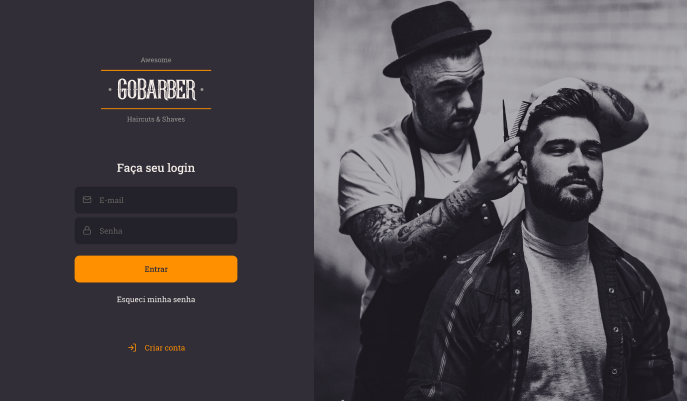

<h1 align="center">
    <a href="https://moveit-gabriel-alexander10.vercel.app/">
        </a>
</h1>
<p align="center">
    
    
    
    
</p>

<p align="center">
 <a href="#about">About</a> • 
 <a href="#features">Features</a> • 
 <a href="#layout">Layout</a> • 
 <a href="#techs">Techs</a> • 
 <a href="#author">Author</a> • 
 <a href="#license">License</a> • 
 <a href="#backend">Backend</a>
</p>

## About

🚀 GoBarber é uma aplicação desenvolvida em ReactJS, que tem como objetivo facilitar o agendamento com os barbeiros da região. O projeto foi desenvolvido durante o Bootcamp GoStack 14 fornecido pela Rocketseat.

## Features

- [x] O usuário pode criar uma conta na plataforma
- [x] O usuário pode agendar um horário com barbeiros
- [x] O barbeiro pode visualizar os horários agendados no dia
- [x] O usuário pode agendar um horário com barbeiros

## Layout
<p align="center">
  
</p> 

Veja o layout completo no 
<a href="https://www.figma.com/file/BXCihtXXh9p37lGsENV614/GoBarber">
Figma
</a>

## How it works

Primeiro, inicie a aplicação frontend web:
> ```bash
> cd ./web
> npm run start
> # or
> yarn start
> ```
> Abra [http://localhost:3000](http://localhost:3000) no seu navegador e veja o resultado.

## Techs

As seguintes tecnologias foram utilizadas no desenvolvimento do projeto:

- [React](https://reactjs.org/)
- [Axios](https://github.com/axios/axios)
- [Date-fns](https://date-fns.org/)
- [Jest](https://jestjs.io/pt-BR/)
- [Styled-components](https://styled-components.com/)
- [Yup](https://github.com/jquense/yup)
- [Prettier](https://prettier.io/)
- [Eslint](https://eslint.org/)

## Author

<a href="https://www.linkedin.com/in/gabriel-alexander-abb90a1b6/" >
 
 <br />
 <sub><b>Gabriel Alexander</b></sub></a>    
<br />
<a href="https://www.linkedin.com/in/gabriel-alexander-abb90a1b6/">
    
</a>

## License

This project is under the license [MIT](./LICENSE).

## Backend
<a href="https://github.com/Gabriel-Alexander10/Gobarber-backend">Verifique também o backend do projeto.</a>
